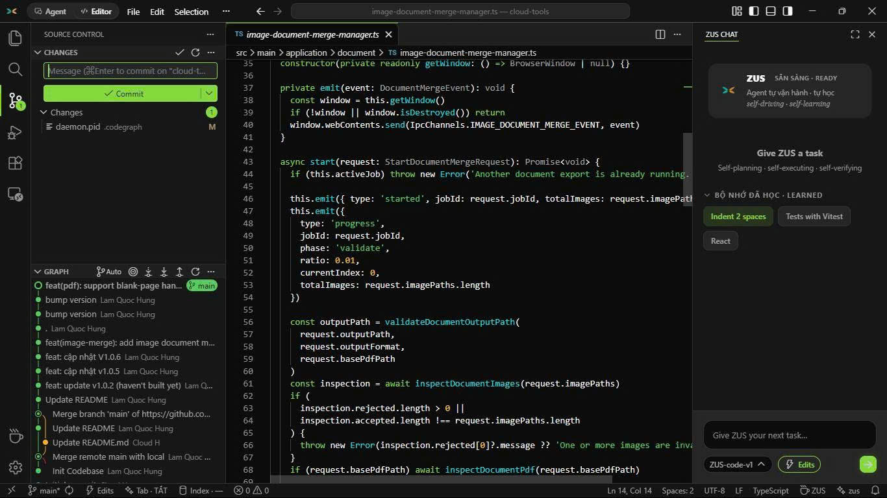
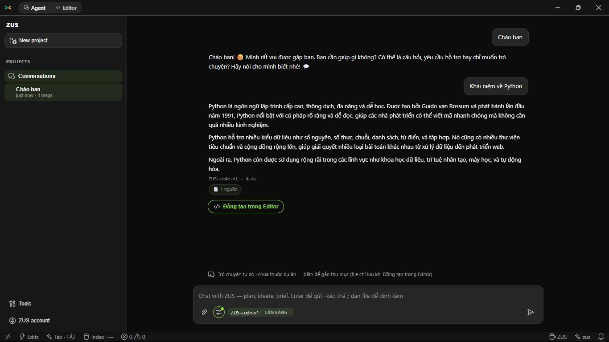
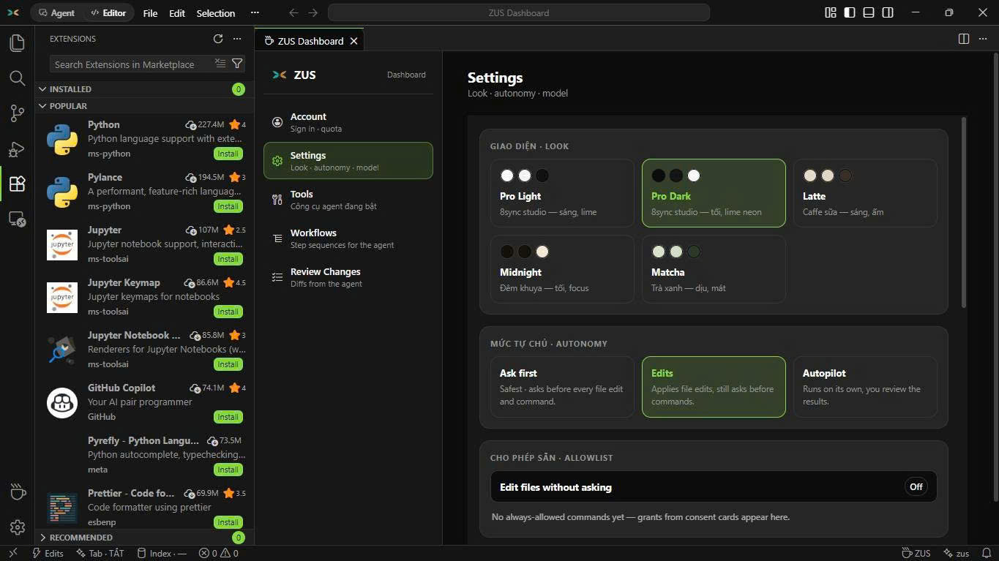

<div align="center">


# ZUS

**A fast, lightweight AI IDE — the full VS Code workbench with a built-in AI agent, in a ~22 MB installer.**

[](https://github.com/8syncdev/zus-releases/releases/latest)
[](https://github.com/8syncdev/zus-releases/releases)


*by [8 Sync Dev](https://8syncdev.com) — sync is a loop: two systems, one link.*

*English below · [Tiếng Việt bên dưới](#-tiếng-việt)*



</div>

---

## 🇬🇧 English

This repository is the **official distribution hub** for ZUS by [8 Sync Dev](https://8syncdev.com) ([@8syncdev](https://github.com/8syncdev)): release binaries, checksums, and the auto-update manifest. Source code is developed in a private repository — every public build lands here.

### Why ZUS

- **Lightweight by architecture** — Tauri 2 (OS WebView + Rust core), no bundled Chromium. Windows installer ≈ 22 MB vs ≈ 200 MB for Electron-based IDEs.
- **AI agent built in** — self-planning, self-executing, self-verifying, with three autonomy levels (Ask first / Edits / Autopilot) and per-command allowlists. Free tier with daily quota, zero API-key setup.
- **Local-first privacy** — your codebase is indexed (embeddings + vector search) **on your machine**. The backend only manages accounts and quotas.
- **Familiar** — full VS Code workbench: Monaco editor, terminal, Git graph, search, and extensions via Open VSX.

<div align="center">
 
</div>

### Install

#### Windows

```powershell
winget install 8syncdev.ZUS
```

```powershell
scoop bucket add zus https://github.com/8syncdev/scoop-zus
scoop install zus
```

Or download `ZUS_x.y.z_x64-setup.exe` from the [latest release](https://github.com/8syncdev/zus-releases/releases/latest).

> **SmartScreen note:** installers are not yet code-signed. Installing via **winget or scoop avoids the prompt**. For a manually downloaded `.exe`, verify it against `SHA256SUMS.txt` (below), then click **More info → Run anyway**.

#### macOS (Apple Silicon)

Download `ZUS_x.y.z_aarch64.dmg`. The app is unsigned — on first open: right-click the app → **Open** → **Open**, or run:

```bash
xattr -dr com.apple.quarantine /Applications/ZUS.app
```

#### Linux

| Distro | Command |
|---|---|
| Debian / Ubuntu | `sudo apt install ./ZUS_x.y.z_amd64.deb` |
| Fedora / RHEL | `sudo dnf install ./ZUS-x.y.z-1.x86_64.rpm` |
| Any | `chmod +x ZUS_x.y.z_amd64.AppImage && ./ZUS_x.y.z_amd64.AppImage` |

### Verify a download

```bash
sha256sum -c --ignore-missing SHA256SUMS.txt
```

`SHA256SUMS.txt` ships with every release. Update artifacts (`.sig`, `latest.json`) are signed with the ZUS updater key (minisign); the app verifies signatures automatically before installing anything.

### Auto-updates

Install once — the app checks `latest.json` in the latest release here on startup and updates itself in place. Every update is **signature-verified before install**. Works for all channels (winget, scoop, direct download); scoop users can also run `scoop update zus`.

---

## 🇻🇳 Tiếng Việt

Đây là **kênh phát hành chính thức** của ZUS: binary, checksum và manifest auto-update. Mã nguồn phát triển ở repo private — mọi bản build công khai đều đưa về đây.

### Vì sao chọn ZUS

- **Nhẹ từ kiến trúc** — Tauri 2 (WebView hệ điều hành + core Rust), không chở Chromium. Installer Windows ≈ 22 MB, so với ≈ 200 MB của các IDE nền Electron.
- **AI agent có sẵn** — tự lập kế hoạch, tự thực thi, tự kiểm chứng; 3 mức tự chủ (Hỏi trước / Sửa file / Autopilot) + allowlist lệnh. Miễn phí theo quota ngày, không cần API key.
- **Local-first, riêng tư** — codebase được index (embedding + vector search) **ngay trên máy bạn**; backend chỉ quản tài khoản và quota.
- **Quen tay** — đầy đủ workbench VS Code: Monaco, terminal, Git graph, search, extensions qua Open VSX. UI tiếng Việt first.

### Cài đặt

**Windows** — copy 1 lệnh vào PowerShell (không dính cảnh báo SmartScreen):

```powershell
winget install 8syncdev.ZUS
```

hoặc qua Scoop:

```powershell
scoop bucket add zus https://github.com/8syncdev/scoop-zus
scoop install zus
```

Hoặc tải `ZUS_x.y.z_x64-setup.exe` từ [bản mới nhất](https://github.com/8syncdev/zus-releases/releases/latest). File tải tay chưa ký cert nên SmartScreen sẽ hỏi — verify `SHA256SUMS.txt` trước, rồi **More info → Run anyway**.

**macOS (Apple Silicon)** — tải `.dmg`, lần đầu mở: chuột phải app → **Open** → **Open**.

**Linux** — `.deb` / `.rpm` / `.AppImage` như bảng tiếng Anh phía trên.

### Auto-update

Cài 1 lần là xong — app tự kiểm tra `latest.json` ở release mới nhất tại đây mỗi lần mở, tự tải và tự cài bản mới. **Mọi bản update đều được xác thực chữ ký số (minisign) trước khi cài** — không sợ giả mạo. Cài qua winget/scoop/tải tay đều auto-update như nhau.

---

<div align="center">


**8 Sync Dev** — Nguyễn Phương Anh Tú (Alex Dev / Kevin Nguyễn) · [8syncdev.com](https://8syncdev.com) · atus@8syncdev.com
*Sync is a loop — two systems, one link.*

</div>
